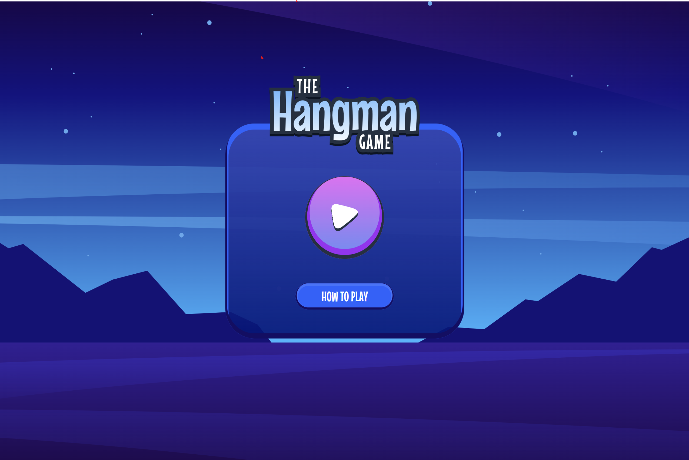

# 🎮 Hangman Game

A modern, responsive implementation of the classic Hangman word guessing game with multiple categories and an engaging user interface.



## ✨ Features

- 🎯 Multiple word categories (Movies, TV Shows, Countries, and more)
- 🎨 Beautiful, responsive UI that works on all devices
- 🔊 Engaging sound effects for interactions
- 🌓 Smooth animations and transitions
- 📱 Progressive Web App (PWA) support
- 🎮 Keyboard and mouse/touch input support
- 💾 Offline playability

## 🚀 Live Demo

[Play the Game](https://hangman-game-app-six.vercel.app/hangmangame) <!-- Replace with your deployed URL -->

## 🛠️ Built With

- React + TypeScript
- Vite
- TailwindCSS
- Zustand (State Management)
- Motion (Animations)
- PWA Support

## 📥 Installation

1. Clone the repository:

```bash
git clone https://github.com/pritamtirpude/hangman-game-app.git
cd hangman-game
```

2. Install dependencies:

```bash
npm install
```

3. Start the development server:

```bash
npm run dev
```

4. Build for production:

```bash
npm run build
```

## 🎯 How to Play

1. Select a category from the available options
2. Guess the hidden word by selecting letters
3. You have 10 chances to guess the word correctly
4. The game shows your remaining lives with a progress bar
5. Win by guessing all letters or lose when you run out of lives

## 📱 PWA Features

- Installable on desktop and mobile devices
- Works offline
- Caches assets for faster loading
- Auto-updates when new content is available

## 🎨 Game Categories

- 🎬 Movies
- 📺 TV Shows
- 🌍 Countries
- 🏛️ Capital Cities
- 🐾 Animals
- ⚽ Sports

## 🔧 Development

### Project Structure

```
src/
  ├── components/      # Reusable UI components
  ├── pages/          # Route pages
  ├── store/          # Zustand store
  ├── utils/          # Utility functions
  └── data.json       # Game words database
```

### Key Features Implementation

- **State Management**: Uses Zustand for managing game state
- **Animations**: Implements Motion for smooth transitions
- **Sound Effects**: Integrated with use-sound for audio feedback
- **Responsive Design**: Tailwind CSS for adaptive layouts
- **PWA**: Service worker and asset caching for offline use

## 📄 License

MIT License - feel free to use this project for learning or personal use.

## 👏 Credits

- Font: Mouse Memoirs by [Astigmatic]
- Sound Effects: [[Source](https://mixkit.co/)]

## 🤝 Contributing

Contributions, issues, and feature requests are welcome! Feel free to check the [issues page](https://github.com/yourusername/hangman-game/issues).

## 📝 To-Do

- [ ] Add more word categories
- [ ] Implement difficulty levels
- [ ] Add multiplayer support
- [ ] Create leaderboard
- [ ] Add more animations

## 📞 Contact

Pritam Tirpude - [@ptirpude1991](https://x.com/ptirpude1991) - pritam.tirpude9601l@gmail.com

Project Link: [https://github.com/pritamtirpude/hangman-game-app](https://github.com/pritamtirpude/hangman-game-app)
